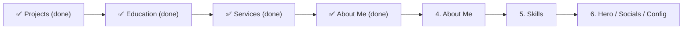

# Payload CMS Migration Analysis

## Current State

**Already managed by Payload:**
- ✅ **Projects** — `Projects` collection with localized fields, image uploads, tech stack, and order sorting
- ✅ **Media** — `Media` collection with responsive image sizes + Vercel Blob storage
- ✅ **Users** — Admin users

**Data flow:** Projects uses a PostHog feature flag (`isPayloadEnabled`) with graceful fallback to `messages/*.json` via [get-projects.ts](file:///Users/propbono/Projects/next-gmozer.ca/apps/gmozer.ca/src/lib/get-projects.ts).

---

## Recommended Migrations (by priority)

### 🟢 Priority 1 — High Value, Low Effort

#### 1. Experience (Work History)

| Aspect | Details |
|--------|---------|
| **Source** | `messages/{en,pl}.json` → `resume.experience.positions` |
| **Data** | 5 positions with position, company, location, duration |
| **Why** | Frequently updated (new jobs/contracts), localized, structured data — perfect CMS fit |
| **Collection** | `Experiences` with localized `position`, `company`, `location`, `duration`, `order`, optional `startDate`/`endDate` date fields |

#### 2. Education

| Aspect | Details |
|--------|---------|
| **Source** | `messages/{en,pl}.json` → `resume.education.items` |
| **Data** | 3 entries with institution, degree, program, duration |
| **Why** | Structured, localized, infrequently changed but benefits from admin UI for edits |
| **Collection** | `Education` with localized `degree`, `institution`, `program`, `duration`, `order` |

#### 3. Services

| Aspect | Details |
|--------|---------|
| **Source** | `messages/{en,pl}.json` → `services.*` (5 services with deep nested content: offerings, process steps, technologies, CTAs) |
| **Data** | ~270 lines of structured content per locale |
| **Why** | **Largest block of static content** in the project — service pages have detailed offerings, process steps, and technologies that are ideal for rich text editing in Payload |
| **Collection** | `Services` with `title`, `slug`, `description`, `icon` (select), rich text `content` blocks for offerings/process/technologies, `order` |

> [!TIP]
> Services have the **most content** in `messages/*.json`. Moving them to Payload would dramatically reduce the size of translation files and make content editing much easier through the admin UI.

---

### 🟡 Priority 2 — Medium Value

#### 4. About Me (Personal Info)

| Aspect | Details |
|--------|---------|
| **Source** | `messages/{en,pl}.json` → `resume.about` |
| **Data** | Bio description + 6 key-value items (name, phone, email, location, nationality, languages) |
| **Why** | Personal details change rarely but benefit from a single editable place; localized bio text is a good fit |
| **Approach** | Payload **Global** (`aboutMe`) rather than a collection — single document with localized fields |

#### 5. Skills / Toolbox

| Aspect | Details |
|--------|---------|
| **Source** | [constants/resume.tsx](file:///Users/propbono/Projects/next-gmozer.ca/apps/gmozer.ca/src/constants/resume.tsx) — 5 categories, 32 skills with JSX icons |
| **Data** | Category → name, link, icon (React component) |
| **Why** | Skills evolve as you learn new tech; managing them in the CMS lets you add/remove without code changes |
| **Challenge** | Icons are currently JSX (`<SiReact />`) — would need an icon mapping strategy (store icon name string in CMS, resolve to component at render time) |
| **Collection** | `Skills` with `name`, `link`, `iconName` (text), `category` (select or relationship to `SkillCategories`), `order` |

> [!IMPORTANT]
> Skills migration requires an **icon resolver** pattern: store `"SiReact"` as a string in Payload, map it to the actual `<SiReact />` component in the frontend. This is a common pattern but adds slight complexity.

---

### 🔵 Priority 3 — Lower Value (Consider Later)

#### 6. Hero Section Content

| Aspect | Details |
|--------|---------|
| **Source** | `messages/{en,pl}.json` → `home.hero` |
| **Data** | Position title, hero title, description, CTA text |
| **Approach** | Payload **Global** (`heroContent`) — rarely changes but could benefit from non-developer editing |

#### 7. Social Links

| Aspect | Details |
|--------|---------|
| **Source** | [constants/socials.ts](file:///Users/propbono/Projects/next-gmozer.ca/apps/gmozer.ca/src/constants/socials.ts) — 3 links with icons |
| **Approach** | Payload **Global** (`socialLinks`) with array field — same icon resolver challenge as Skills |

#### 8. Site Configuration

| Aspect | Details |
|--------|---------|
| **Source** | [constants/main.ts](file:///Users/propbono/Projects/next-gmozer.ca/apps/gmozer.ca/src/constants/main.ts) — dev start date, resume PDF links, technologies mastered count |
| **Approach** | Payload **Global** (`siteConfig`) — centralize all site-wide constants |

---

## What Should Stay in `messages/*.json`

These items are **UI labels and strings** that are best kept in i18n files:

- Navigation labels (`navigation.*`)
- Form field labels, placeholders, errors (`contact.form.*`)
- Error/404 page text (`error.*`, `notFound.*`, `globalError.*`)
- Button labels (`work.visitSite`, `work.sourceCode`, etc.)
- Locale switcher labels
- Page metadata (titles, descriptions, OpenGraph) — tightly coupled to page routes
- Footer copyright

> [!NOTE]
> The boundary is: **content you'd want a non-developer to edit** → Payload. **UI chrome / labels** → `messages/*.json`.

---

## Suggested Migration Order

Each migration follows the proven pattern from Projects:
1. Create Payload collection/global
2. Create `getXxxFromPayload()` fetcher
3. Add PostHog feature flag fallback
4. Populate data via admin UI
5. Gradual rollout → cleanup

---

## Impact Summary

| Content Area | Lines in JSON | Localized | Payload Type | Effort |
|---|---|---|---|---|
| Experience | ~30 | ✅ | Collection | Low |
| Education | ~20 | ✅ | Collection | Low |
| Services | ~270 | ✅ | Collection | Medium |
| About Me | ~15 | ✅ | Global | Low |
| Skills | ~130 (TSX) | ❌ | Collection | Medium |
| Hero | ~5 | ✅ | Global | Low |
| Socials | ~10 (TS) | ❌ | Global | Low |
| Site Config | ~15 (TS) | ❌ | Global | Low |
| **Total** | **~495 lines** | | | |

Moving all of these would eliminate nearly all static content from code, making the site fully CMS-driven for content while keeping UI labels in i18n.
